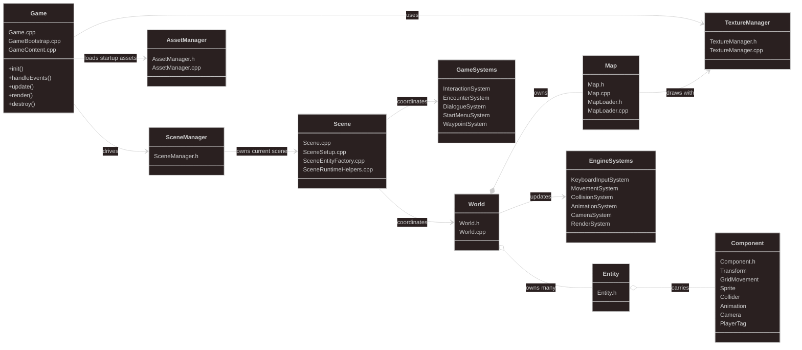
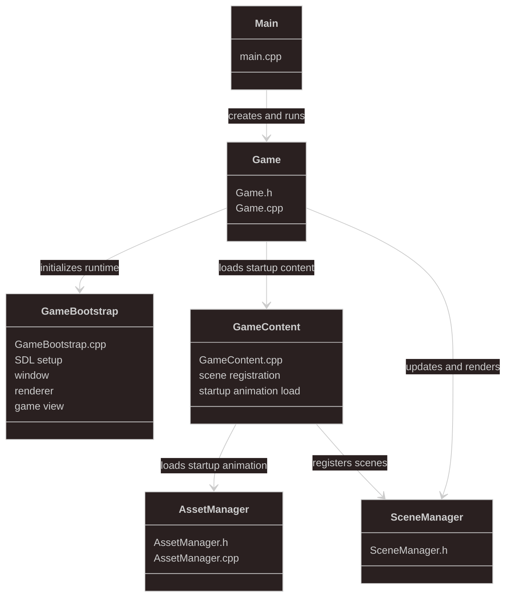
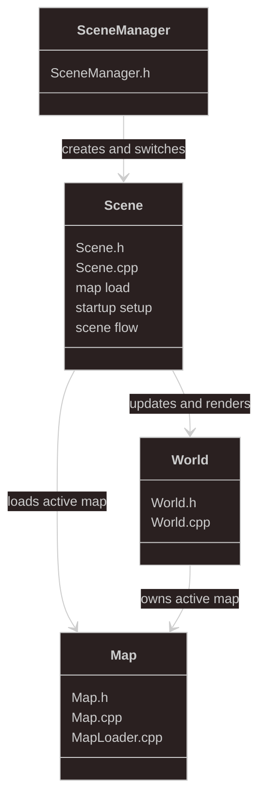
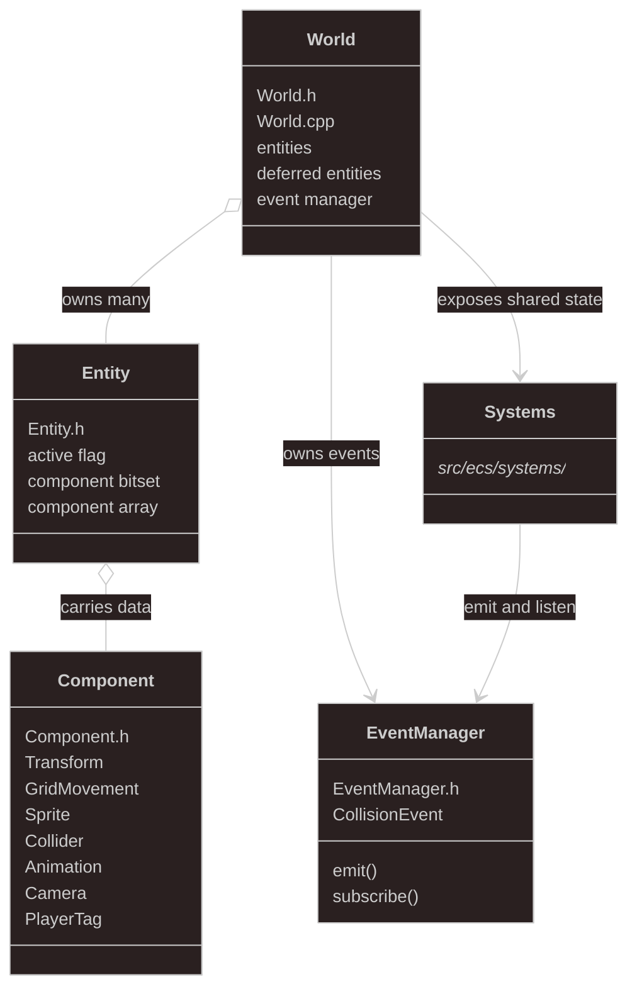
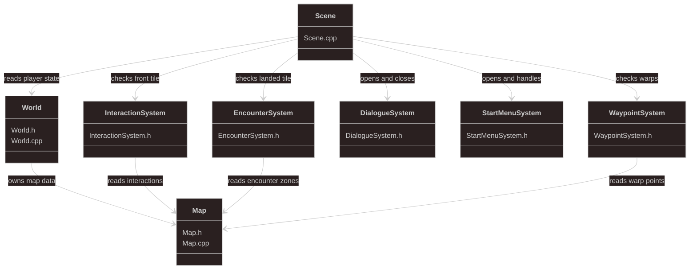
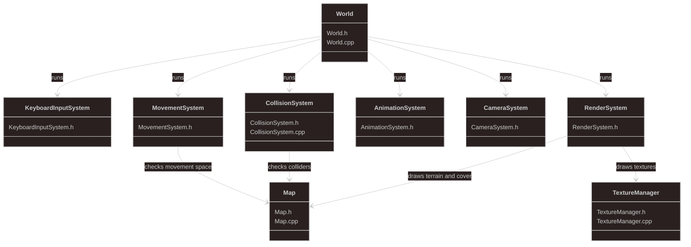
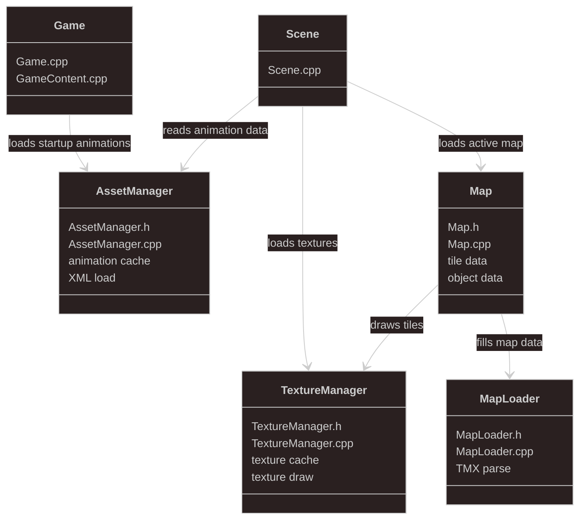

# PokemonCipher 🎮

A custom 2D engine plus game prototype for a Pokémon-style RPG built in C++20 with SDL3.

PokemonCipher is engine-first. The current game uses Pokémon FireRed as a baseline for assets, UI conventions, and core gameplay structure, but the runtime itself is a separate implementation focused on modernizing the exploration, scripting, UI, and battle pipeline on top of a custom engine.

> ⚠️ This repository is an educational/prototype project. It is not affiliated with Nintendo, Game Freak, or The Pokémon Company.

---

## 🛠️ Tech Stack
| Area | Tech |
| --- | --- |
| Language | C++20 |
| Build | CMake, vcpkg |
| Windowing / Input / Rendering | SDL3, SDL3_image |
| Data Formats | TMX |
| Scripting | Lua |
| Parsing / Utilities | tinyxml2|

---

## 📁 Repo Layout
- `src/` engine and game runtime code
- `assets/` canonical runtime assets
- `assets/config/` Lua-driven runtime registries and UI layout tuning
- `build/` generated build outputs

---

## 🧭 Gameplay Prototype Goals
Flow in the current prototype:
1. Boot into intro, overworld, or auto-start flow
2. Explore a map using tile-step movement and collision
3. Trigger scripts, warps, and encounter regions
4. Transition into a battle scene
5. Resolve battle flow and return to the overworld with state preserved

Current design direction:
- FireRed-style overworld
- Engine built independently from the original game
- Future mechanical extensions may include battle timing ideas such as dodging/blocking and Colosseum-inspired snagging concepts

The current priority is a reliable vertical slice, not a full campaign.

---

## ⌨️ Controls
- `WASD` or arrow keys to move

---

## 📜 Lua Scripting
Lua will be used for event/content scripting rather than hardcoding one-off gameplay flows in C++.

---

## ▶️ Getting Started (Windows)
Requirements:
- Visual Studio 2026 or newer
- CMake
- vcpkg installed and `VCPKG_ROOT` set

Build with presets:

```powershell
cmake --preset vs2026
cmake --build --preset debug
```

Run:

```powershell
build\Debug\PokemonCipher.exe
```
---

## Engine Architecture
This diagram stays intentionally high-level. It shows the runtime as a set of engine and gameplay responsibilities without getting into file-by-file helper splits.



## Architecture Slides
These smaller views are meant for slides. Each one focuses on a single part of the engine and how it connects to the rest of the runtime.

### Game Runtime
Files: `main.cpp`, `Game.cpp`, `GameBootstrap.cpp`, `GameContent.cpp`

- start the program
- initialize SDL and the game view
- create the window and renderer
- load startup assets
- register the available scenes
- run the main loop through `SceneManager`



### Scene Orchestration
Files: `SceneManager.h`, `Scene.h`, `Scene.cpp`

- register scene parameters
- create and switch scenes
- load the active map
- build scene startup state
- coordinate scene-level flow
- hand update and render to `World`



### ECS Core
Files: `World.h`, `World.cpp`, `Entity.h`, `Component.h`, `EventManager.h`

- own the active world state
- store entities in `World`
- attach data through components
- expose shared state to systems
- support deferred entity creation
- publish simple collision events



### Gameplay Systems
Files: `InteractionSystem.h`, `EncounterSystem.h`, `DialogueSystem.h`, `StartMenuSystem.h`, `WaypointSystem.h`

- check the tile in front of the player
- trigger scene-level interactions
- trigger wild encounters after movement
- open and close dialogue flow
- open and handle the start menu
- switch maps through waypoint rules



### Engine Systems
Files: `KeyboardInputSystem.h`, `MovementSystem.h`, `CollisionSystem.*`, `AnimationSystem.h`, `CameraSystem.h`, `RenderSystem.h`

- read raw keyboard input
- move entities through the world
- block invalid movement and collisions
- update animation and camera state
- render terrain, entities, and cover
- run the lower-level frame simulation



### Assets and World Data Resources
Files: `AssetManager.*`, `TextureManager.*`, `Map.h`, `Map.cpp`, `MapLoader.h`, `MapLoader.cpp`

- load animation data from XML
- cache textures for reuse
- parse TMX map files
- store tile and object-layer data
- provide resources to game and scene startup
- provide map data to rendering


