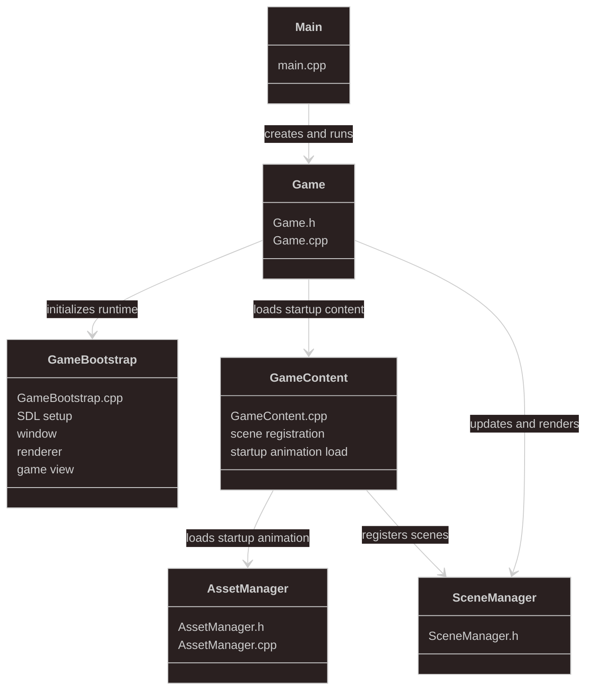
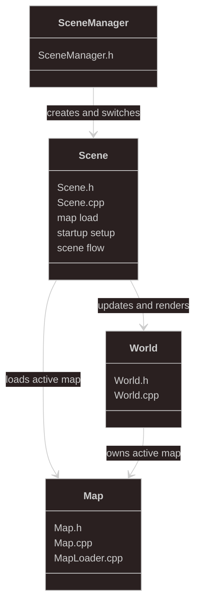
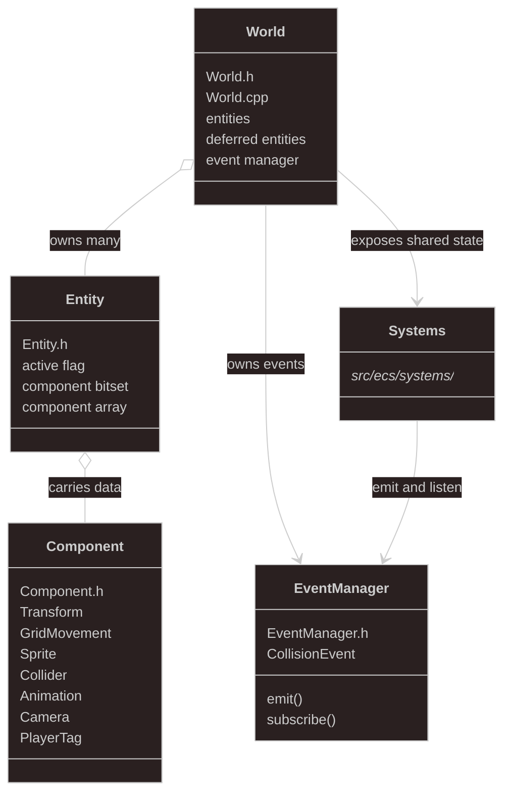
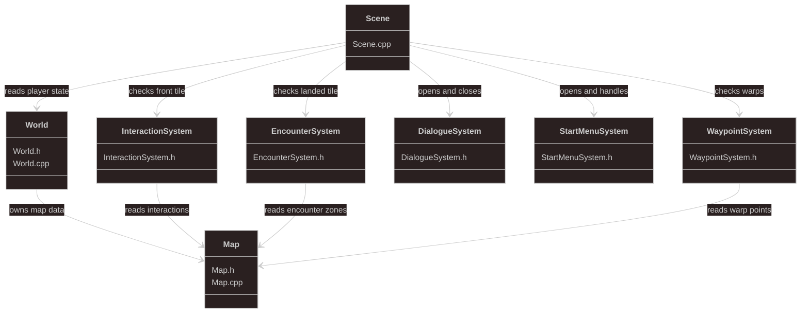
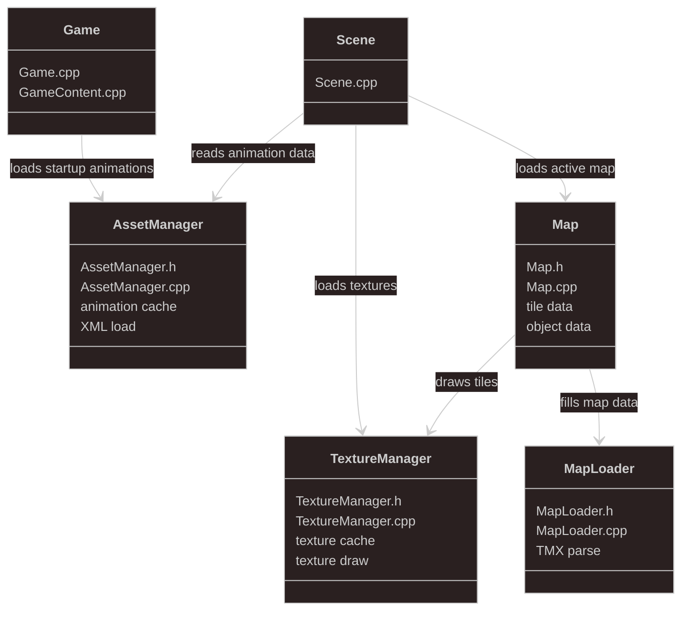

# PokemonCipher

PokemonCipher is a C++20 / SDL3 Pokemon-style overworld prototype.

The current repo is focused on exploration systems and map flow rather than a full RPG. It has connected maps, tile movement, collisions, warps, a simple start menu shell, one working interaction example, and random grass encounters presented as dialogue popups.

This is an educational prototype project and is not affiliated with Nintendo, Game Freak, or The Pokemon Company.

## Current Scope

What is currently implemented:

- Connected overworld maps for Pallet Town, Route 1, Player's House 1F, Player's House 2F, Rival's House, and Oak's Lab
- Tile-based movement and camera
- TMX map loading
- Collision, cover tiles, spawn points, and warp points
- Random wild encounter popups in Route 1 grass
- One working interaction in Oak's Lab
- A simple start menu with placeholder entries

What is not implemented yet:

- Battle scenes
- Save/load
- Full NPC scripting/content systems
- Finished menu screens

## Controls

- Move: `WASD` or arrow keys
- Confirm / interact / advance dialogue: `Enter`, `Numpad Enter`, `Space`, or `Z`
- Open the start menu while standing still: `Esc`, `Tab`, or `Enter`
- Move the menu cursor: `W` / `S` or Up / Down
- Close the menu: `Esc`, `X`, or `Backspace`

## Run Without Compiling

If you just want to run the project on Windows, use the tracked runtime package:

```powershell
release\windows\PokemonCipher.exe
```

That folder includes:

- `PokemonCipher.exe`
- required DLLs
- a local copy of the trimmed runtime `assets/` folder

The duplicated `assets/` folder is intentional here so the packaged executable works directly after clone without depending on the generated CMake build tree.

## Build From Source (Windows)

Requirements:

- Visual Studio 2026
- CMake 3.22+
- vcpkg

Important: the current preset in `CMakePresets.json` assumes vcpkg is installed at `C:\dev\vcpkg`. If your vcpkg installation lives somewhere else, update that file before configuring.

Configure and build:

```powershell
cmake --preset vs2026
cmake --build --preset release
```

Run the locally built executable:

```powershell
build\Release\PokemonCipher.exe
```

The build copies `assets/` next to the executable automatically.

## Repo Layout

- `src/` - C++ source code
- `assets/` - trimmed runtime assets used by the current prototype build
- `build/` - local CMake output (ignored by git)
- `release/windows/` - tracked Windows runtime folder for running the game without compiling

## Tech Stack

| Area | Tech |
| --- | --- |
| Language | C++20 |
| Build | CMake, vcpkg |
| Windowing / Input / Rendering | SDL3, SDL3_image |
| Data Formats | TMX, XML |
| Parsing / Utilities | tinyxml2 |
| Extra Dependency | Lua is still listed in `vcpkg.json`, but it is not wired into the current runtime |

## Architecture

Start with this view if you are new to the repo. It shows the main runtime layers and the handoff from the game loop into scene management, world state, and the engine/gameplay systems that operate on that state.


## Detailed Architecture Views

These follow-up diagrams zoom in on one slice of the runtime at a time. They are best read after the high-level view above, and they are meant to clarify responsibilities rather than act as a complete file-by-file reference.

### Game Runtime

This view covers startup and the main loop. It shows how the executable bootstraps SDL, loads startup content, and hands frame-by-frame work to the scene layer.

Files: `main.cpp`, `Game.cpp`, `GameBootstrap.cpp`, `GameContent.cpp`

- start the program
- initialize SDL and the game view
- create the window and renderer
- load startup assets
- register the available scenes
- run the main loop through `SceneManager`



### Scene Orchestration

This is the map and scene coordination layer. It shows how scene definitions become active runtime scenes, how maps are loaded, and where control passes into the world update/render flow.

Files: `SceneManager.h`, `Scene.h`, `Scene.cpp`

- register scene parameters
- create and switch scenes
- load the active map
- build scene startup state
- coordinate scene-level flow
- hand update and render to `World`



### ECS Core

This is the runtime data layer. It shows where entities and components live, how systems access shared state, and where lightweight event flow fits into the world model.

Files: `World.h`, `World.cpp`, `Entity.h`, `Component.h`, `EventManager.h`

- own the active world state
- store entities in `World`
- attach data through components
- expose shared state to systems
- support deferred entity creation
- publish simple collision events



### Gameplay Systems

This slice focuses on higher-level overworld behavior rather than low-level simulation. These systems sit close to scene flow and player-facing interactions such as talking, encounters, menus, and warps.

Files: `InteractionSystem.h`, `EncounterSystem.h`, `DialogueSystem.h`, `StartMenuSystem.h`, `WaypointSystem.h`

- check the tile in front of the player
- trigger scene-level interactions
- trigger wild encounters after movement
- open and close dialogue flow
- open and handle the start menu
- switch maps through waypoint rules



### Engine Systems

This is the lower-level frame simulation and rendering pass. It covers the systems that update movement, collision, animation, camera state, and drawing against the active map each frame.

Files: `KeyboardInputSystem.h`, `MovementSystem.h`, `CollisionSystem.*`, `AnimationSystem.h`, `CameraSystem.h`, `RenderSystem.h`

- read raw keyboard input
- move entities through the world
- block invalid movement and collisions
- update animation and camera state
- render terrain, entities, and cover
- run the lower-level frame simulation


### Assets and World Data

This view explains how external files become usable runtime state. It covers animation loading, texture caching, TMX parsing, and how that loaded data feeds scene startup and rendering.

Files: `AssetManager.*`, `TextureManager.*`, `Map.h`, `Map.cpp`, `MapLoader.h`, `MapLoader.cpp`

- load animation data from XML
- cache textures for reuse
- parse TMX map files
- store tile and object-layer data
- provide resources to game and scene startup
- provide map data to rendering


